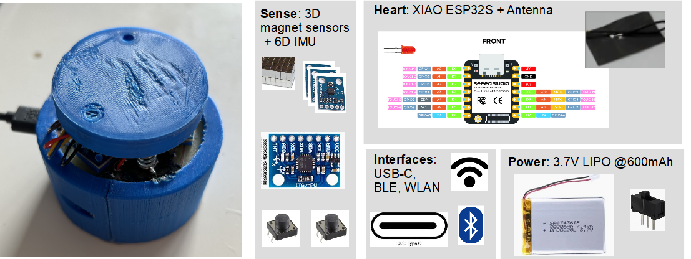

# Galaxy6D

Galaxy6D is a simple DIY full 6D knob as input device (e.g. for CAD) based on 3D magnetic 
sensors and an inertial measurement unit. Read full documentation including a 
market overview of existing devices on [github pages](https://bastelbaus.github.io/Galaxy6D/). 
The project is in early ideation phase. Follow my log on [hackaday.io](https://hackaday.io/project/192855). 

# Content 

* System: Simulation of the measurement system (Python)
* Electronics: schematics (KiCad)
* Mechanics: 3D models of the knob to be 3D printed (FreeCad3D)
* Firmware: code running on the microcontroller (c/c++)
* Galaxy6DLib: Python library with the knob model used in Simulation and Config Software  (Python)
* ConfigSoftware: Configuration software (Python)
* data: filder where measurement and simulation data is stored
* docs: folder with the project documentation

# Project ToDo's

* Power Mgmt
* Buttons
* Layout:
  * measure if USB is connected !?
  * switch Battery Knob connection
  * solder protection

