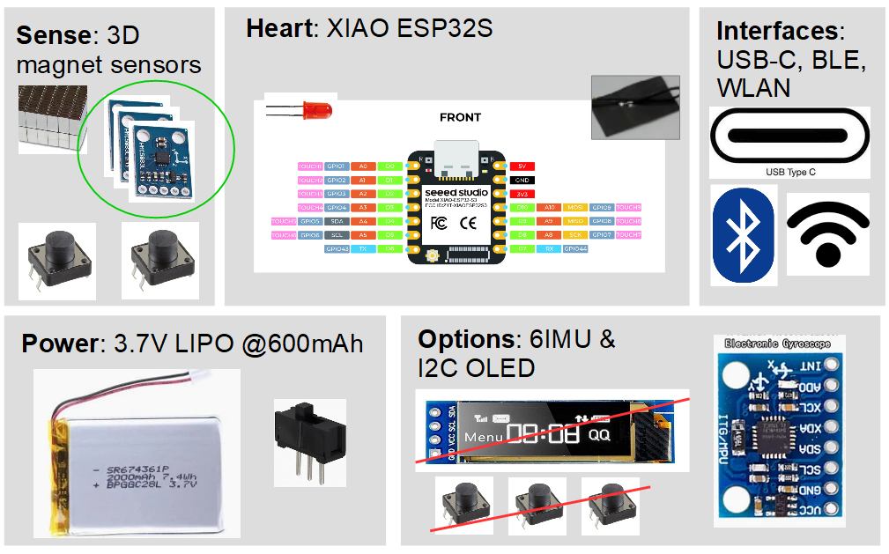

# Galaxy6D

Galaxy6D is a simple DIY full 6D knob as input device (e.g. for CAD) based on 3D magnetic 
sensors and an inertial measurement unit. Read full documentation including a 
market overview of existing devices on [github pages](https://bastelbaus.github.io/Galaxy6D/). 
The project is in early ideation phase. Follow my log on [hackaday.io](https://hackaday.io/project/192855). 

