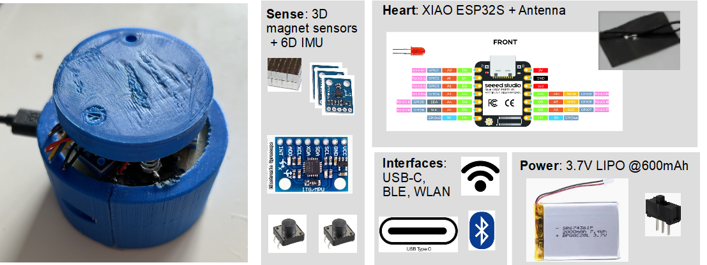

.. Galaxy6D documentation master file, created by
   sphinx-quickstart on Thu Jun 27 23:09:47 2024.
   You can adapt this file completely to your liking, but it should at least
   contain the root `toctree` directive.

Welcome to Galaxy6D's documentation!
====================================

Galaxy6D is a simple DIY full 6D knob based on magnetic sensors, 
permanent magnets and an inertial measurement unit which can be 
used as input device (i.g. for CAD, ...).

.. toctree::
   :maxdepth: 0
   :caption: Contents:

   market
   design_concepts
   signal_processing_concept
   cost_breakdown
   links
   Galaxy6DLib
   

..
   The following links will lead you to several detailed pages:
   * `DIY and professional market overview <market.rst>`_
   * Design description
      * `Hardware design concepts <design_concept.md>`_
      * `Functional design <signal_processing_concept.md>`_
      * Hardware design
      * Electronic design
      * Software design
         * Firmware (C/C++)
         * Configuration software (Python)
         * Driver software - HID (t.b.d.)
   * `_Cost estimation <cost_breakdown.md>`_
   * `Some other related links <links.md>`_

..
   :ref:`overview`
   .. include:: overview.rst
   .. include:: market.rst
   :undoc-members:

Indices and tables
==================

* :ref:`genindex`
* :ref:`modindex`
* :ref:`search`
