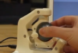
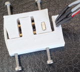

Market overview
=========================

This page gives an overview on different DIY and professional products on the market. 
Last update Sep/2023. Refer also to `hackaday.io <https://hackaday.io/pages/1354157>`__.

Full 6D DIY projects
----------------------------------------------

..  csv-table:: 
    :header: started, name, author, link, picture, status, "detection and electronics", mechanics
    :widths: 5, 10,10,10,10,10,25,25
    :align: left

    2016 , Spacefox                 , "Pepijn de Vos             
    ","`link <https://github.com/pepijndevos/spacefox>`__  `video <https://www.youtube.com/watch?v=rLTWWPftyac>`__ 
    ", |Spacefox1| |Spacefox2|, "finished w/ video" , Stewart platform made from potentiometers
    ", 3D prints & cuts from triplex 
    2022 , OS3M Mouse	            , "Colton Baldridge          
    ", "`link <https://hackaday.io/project/187172-os3m-mouse>`__ 
    ", |OS3MMouse| , "in development 
    ", "inductance to digital sensors for distance to w/ metal object as Stewart platform
    ", 3D print (included printed spring mechanism) 
    2022 , Shamrock Sixnav	        , "Brian Lu (GreenCap)
    ", "`link <https://www.electromaker.io/project/view/shamrock-sixnav-low-cost-compatible-6dof-space-mouse>`__ 
    ", |Shamrock| ,"HW pictures, raw data but no final results 
    ", "IR LED + Phototransistor, variable thickness plastics (IR damping)
    ", 3D printing + Springs
    2022 , Space Mushroom	        , "Shiura
    ","`link <https://www.instructables.com/Space-Mushroom-Full-6-DOFs-Controller-for-CAD-Appl/>`__ `video <https://www.youtube.com/watch?v=Vs6Xte4gOxk>`__
    ", |Mushroom|, "finished w/ video 
    ", "Stewart platform made from potentiometers (3x 2D analog joysticks)
    ", 3D printed 
    2013 , 6D (axsotic)             , "valentin heun             
    ", "`link <http://valentinheun.com/portfolio/6d/>`__
    ", |axsotic|,  start of a startup which is no longer existing  , "? 
    ", 3D printed ?
    2021 , 6D input                 , "RepRap Ltd.               
    ", "`link <https://github.com/RepRapLtd/6DInput/tree/main/RepRapLtd#update-3>`__ 
    ", |6DInput| , "investigation phase 
    ", "Based on DIY force sensors, but also discussing 6 magnetic sensors 
    ", 3D printed
    2022 , Haptik 6DOF input device , "Matthew Schubert          
    ", "`link <https://blog.ioces.com/matt/posts/haptick-part-two>`__ & `video <https://youtu.be/miJmKHkGehw>`__ 
    ", |6DOFHaptik| , "prototype build 
    "," Based on force sensors (strain gauges) and Steward platform principle
    ",  n/a 
    2024 , One more 3D mouse        , "Vedran                    
    ", "`link <https://hackaday.io/project/196687>`__ 
    ", |OM3DM|, "first tests
    ", "magnets and hall effect sensors
    ", 3D printed spring
   2024, Hall Effect CAD Mouse / Spacemouse, "John Crombie
   ", "`video <https://www.youtube.com/watch?v=ybhJu3VXs2Q>`__ 
   `repo <https://github.com/ChromeBee/Hall-Effect-Sensor-CAD-Mouse-Spacemouse>`__ 
    ", |HallEffectCADMouse|, "working
    ", "magnets and hall effect sensors
    ", 3D printed spring
   

.. |Spacefox1| image:: images/spacefox_v1.png
   :width: 40pt
   :height: 40pt
   :align: top
.. |Spacefox2| image:: images/spacefox_v2.jpg
   :width: 40pt
   :height: 40pt
   :align: top
.. |OS3MMouse| image:: images/OS3M_Mouse.png
   :width: 40pt
   :height: 40pt
   :align: top
.. |Shamrock| image:: images/Sixnav.png
   :width: 40pt
   :height: 40pt
   :align: top

.. |6DOFHaptik| image:: images/haptick-matt.jpg
   :width: 40pt
   :height: 40pt
   :align: top
.. |OM3DM| image:: images/OM3DM.png
   :width: 40pt
   :height: 40pt
   :align: top   

Full 6D professional products
----------------------------------------------

..  csv-table:: 
    :header: "Product Name", Company, Picture, Technology, Comment
    :widths: 10, 10,10,25,25

    SpaceMouse, |SpaceMouseCompany| ,|SpaceMouse| , |SpaceMouseTech| , |SpaceMouseComment|

.. |SpaceMouseCompany| replace:: `3D connexion <https://3dconnexion.com/de/>`__
.. |SpaceMouseComment| replace:: Probably the market leader.
                                 Teardowns: `link <https://www.alvarez-engineer.com/2022/03/20/spacenavigator-teardown/>`__ or `link <https://www.fictiv.com/teardowns/spacenavigator-3d-mouse-teardown>`__ or `video <https://www.youtube.com/watch?v=1R7NCH_1UDI>`__
.. |SpaceMouseTech| replace:: 3 or 6 optical position sensors with 6 LEDs and slit structure, 
                              3 springs, plastic housing and metal block mount

Less than 6D (DIY) projects
----------------------------------------------

- `DIY-Space-Mouse <https://github.com/soemarko/DIY-Space-Mouse>`__
- `SpaceRat V2 DIY / Getting closer to 3Dconnexion <https://www.youtube.com/watch?v=68EapQbDBOc>`__
- `DIY-Space-Mouse with magnet sensor <https://www.instructables.com/DIY-Space-Mouse-for-Fusion-360-Using-Magnets/>`__
- `Mighty Mouse (3D) <https://github.com/mattogodoy/mighty-mouse>`__
- `Hyper Controler (2x2D) <https://github.com/mnesarco/HyperController>`__
- `Dial V2 (5D) <https://www.hackster.io/ahmsville/ahmsville-dial-v2-a38b17>`__
- `tams_printed_ft <https://github.com/TAMS-Group/tams_printed_ft>`__
